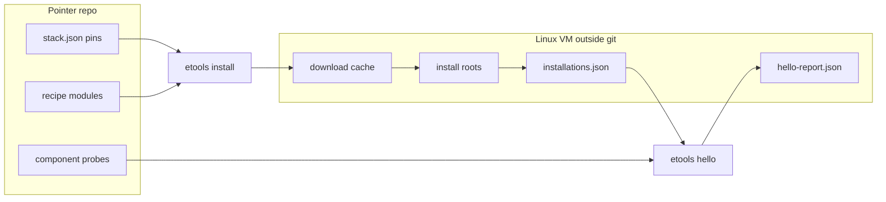
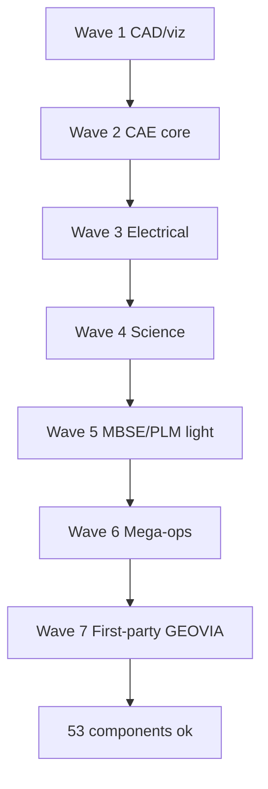

# feat: Pointer-repo install and component-green hello

## Goal Capsule

Make `engineering-tools` a repeatable pointer repository that pins, installs (outside Git), and independently verifies **53** in-scope stack components on Ubuntu 24.04 x86-64 so each reports `status: ok` under `etools hello`, without product interconnect or 3DEXPERIENCE GUI work.

**Authority:** Approved design `docs/superpowers/specs/2026-09-20-pointer-repo-component-install-design.md` (see origin); extend but do not weaken `docs/superpowers/specs/2026-09-11-open-source-stack-manifest-hello-design.md` and `STRATEGY.md` Alpha invariants (one mapping per inventory row; third-party trees outside Git; component ≠ product coverage).

**Stop when:** Definition of Done is met — all 53 in-scope components are `ok` on the reference VM with matching receipts; product probes and 3DEXPERIENCE composition remain deferred.

---

## Product Contract

### Summary

Operators clone this repo, run `etools install` (by component, wave, or all in-scope), and use `etools hello` to prove every non-3DEXPERIENCE mapping dependency is independently installable and probed. The git tree stays a ledger of pins, recipes, and small owned fixtures/models — not a warehouse of upstream binaries. Aggregate Alpha `ok: true` is intentionally not required in this phase.

Product Contract preservation: Product Contract unchanged from design-spec origin (requirements restated with stable R-IDs for traceability).

### Requirements

- R1. Every component required by proprietary mappings except the deferred 3DEXPERIENCE platform mapping is in scope (53 components, including electrical and first-party GEOVIA models).
- R2. Each in-scope component has a resolved immutable pointer (`artifact`+sha256, `container`+digest, or `source`+commit) in packaged `stack.json`.
- R3. Each in-scope component has an implemented hybrid install recipe that installs outside the git worktree.
- R4. `etools install` supports single id, `--wave <name>`, and `--all` (in-scope only), with optional `--force`.
- R5. Successful installs write verified receipts to `ETOOLS_HOME/installations.json` (`locator`, `immutable_id`, `integrity_verified: true`, recipe id, timestamp).
- R6. Each in-scope component has an implemented independent component `hello` probe registered for dispatch.
- R7. Phase success is judged by all in-scope components reporting `status: ok` in `hello-report.json`; aggregate `ok` may remain false.
- R8. Product/capability probes, interconnect workflows, and GUI/3DEXPERIENCE composition are out of scope.
- R9. Hosted CI must not claim reference-VM certification; fake install/probe paths only.
- R10. Wave membership is exhaustive and exclusive for the 53 in-scope components.

### Scope Boundaries

**In scope:** Install subsystem; manifest pin/recipe/probe completion for 53 components; hybrid recipes; first-party GEOVIA models; wave CLI; component probes; VM evidence path.

**Out of scope / deferred for later:** Product probes; multi-tool workflows; 3DEXPERIENCE GUI composition; inventory audit freeze / Alpha aggregate certification; vendoring upstream trees into Git.

**Outside this product's identity:** Forking or rebasing Salome_Meca / OpenFOAM / Code_Aster / other GPL upstreams into this org.

### Acceptance Examples

- AE1. Fresh Ubuntu 24.04 VM: clone repo → `etools install --wave 1-cad-viz` → those six components show `ok` in `etools hello --json` component rows.
- AE2. `etools install --all` is idempotent when receipts match pins; `--force` re-fetches and re-verifies.
- AE3. Install target resolving inside the git worktree is refused with a typed error and no verified receipt.
- AE4. Digest/commit mismatch aborts that component without writing `integrity_verified: true`.
- AE5. After all waves, all 53 in-scope components are `ok`; products remain `probe-unimplemented`; deferred 3DEXPERIENCE mapping does not block the phase gate.

---

## Planning Contract

### Assumptions

- A1. Proceeding with **provisional** inventory and mass install on the reference VM is intentional for this phase, even though `STRATEGY.md` prefers audit-before-mass-install; Alpha aggregate certification remains blocked until a later audit freeze.
- A2. Exact upstream URLs, digests, and package versions are resolved during implementation research per component; the plan does not freeze those values.
- A3. Reference VM has sufficient disk, network, and privilege for Wave 6 mega-stacks (OpenStack, ROS, etc.).
- A4. Stdlib-only runtime is preserved (no new runtime dependencies beyond the existing package).

### Key Technical Decisions

| ID | Decision | Rationale |
| --- | --- | --- |
| KTD1 | New `install` package surface (`install.py` / recipe modules) + `etools install` CLI, mirroring `hello`/`run` argparse patterns | No install/download code exists today; keep stdlib CLI consistency (`cli.py`) |
| KTD2 | Hybrid recipe kinds: `container`, `appimage`, `apt`, `pip`, `upstream-archive`, `first-party-module` | Matches approved design; avoids forcing everything into images |
| KTD3 | Receipts gained a writer API next to existing `load_installations` / `installation_for` in `verification.py` | Hello already gates on receipts; install must be the producer |
| KTD4 | Wave registry is first-party data (constant or manifest-adjacent), tested for 53-way coverage | Prevents silent omission of electrical / GEOVIA / mega-ops |
| KTD5 | Component probes extend `hello_probes.COMPONENT_PROBES`; products stay unimplemented | Preserves component≠product invariant |
| KTD6 | First-party GEOVIA models ship as small MIT modules under package data / `src/engineering_tools/` — not as vendor blobs | Design requires full bar for MineSched/Whittle stand-ins |
| KTD7 | Exact pins are implementation-time research; validation only enforces identity shape once `resolved` | Avoids fake digests in the plan |

### High-Level Technical Design





Install per component (directional):

```text
load manifest → resolve component
if receipt matches pin and not --force → skip
fetch to ETOOLS_HOME/downloads (or recipe cache) outside worktree
verify identity → install to recipe root outside worktree
write receipt → continue wave
```

### Patterns to Follow

- CLI: `src/engineering_tools/cli.py` subparser + `set_defaults(func=…)`.
- Probes: `src/engineering_tools/hello_probes.py` result shape + `COMPONENT_PROBES` registry.
- Receipts/home: `src/engineering_tools/verification.py`, `src/engineering_tools/registry.py` (`ETOOLS_HOME`).
- Manifest gates: `src/engineering_tools/manifest.py` identity rules already encode resolved-source shape.
- Tests: `tests/test_hello.py` reduced manifests + `ETOOLS_HOME` isolation; fake PATH binaries.
- Package data: `pyproject.toml` `[tool.setuptools.package-data]` for fixtures/models.

### Alternative Approaches Considered

- External Ansible/shell bootstrap with thin Python wrappers — rejected; splits truth away from the pointer repo.
- Container-universe for almost everything — rejected; conflicts with hybrid decision and pip-native / first-party models.

---

## Implementation Units

### U1. Install recipe runner and receipt writer

**Goal:** Trusted fetch → verify → install-outside-worktree → write receipts; refuse in-repo targets.

**Requirements:** R3, R5, AE3, AE4

**Dependencies:** None

**Files:**
- Create: `src/engineering_tools/install.py` (or `install/` package with runner + kinds)
- Modify: `src/engineering_tools/verification.py` (receipt write/update API)
- Create: `tests/test_install.py`

**Approach:** Define recipe protocol keyed by recipe id and kind. Implement shared path guards (resolve paths; error if under git worktree or package root). Atomic or replace-safe receipt updates under `components[id]`. Support skip-when-matching and `--force`.

**Execution note:** Implement test-first for path-escape refusal and digest-mismatch (no verified receipt).

**Test scenarios:**
- Happy path: fake archive recipe with known sha256 installs to temp root outside worktree and writes `integrity_verified: true`.
- Edge: matching receipt skips fetch unless `--force`.
- Error: sha256 mismatch → non-zero, no verified receipt.
- Error: install destination under simulated repo root → refused.
- Error: unsupported recipe kind → typed failure.

**Verification:** Unit tests green; no network required for fake fixtures.

---

### U2. `etools install` CLI and wave registry

**Goal:** Operator-facing install entrypoints and exclusive wave membership for 53 components.

**Requirements:** R1, R4, R10, AE1, AE2

**Dependencies:** U1

**Files:**
- Modify: `src/engineering_tools/cli.py`
- Create or modify: wave registry module (e.g. `src/engineering_tools/install_waves.py`)
- Modify: `tests/test_cli.py`
- Create/extend: `tests/test_install.py` or `tests/test_install_waves.py`

**Approach:** Subcommands matching design: `etools install <id>`, `--wave`, `--all`, `--force`, optional `--json` summary. `--all` = union of waves (non-3DEXPERIENCE deps only). One component failure does not abort remaining installs; exit nonzero if any failed.

**Test scenarios:**
- Happy path: CLI dispatches single id and wave name to runner (mocked).
- Covers AE2: `--all` idempotent path when runner reports skipped.
- Edge: unknown component id / unknown wave → nonzero + clear error.
- Integration: wave membership test — exactly the 53 in-scope ids, no duplicates, no 3DEXPERIENCE-only platform component required for green gate.
- Error: partial wave failure → summary lists failures, overall nonzero.

**Verification:** CLI help lists install; wave coverage test asserts count 53.

---

### U3. Manifest pin and recipe state completion scaffolding

**Goal:** Make packaged manifest able to express resolved pins + implemented recipes for in-scope components, with validation and attribution hooks ready for wave fills.

**Requirements:** R2, R3

**Dependencies:** None (can parallelize with U1)

**Files:**
- Modify: `src/engineering_tools/data/stack.json` (progressively; scaffolding rules first)
- Modify: `src/engineering_tools/manifest.py` if recipe-kind or wave metadata needs validation
- Modify: `tests/test_manifest.py`
- Modify: `THIRD_PARTY.md` as components land (ongoing)

**Approach:** Keep existing identity validation. Optionally validate that `install_recipe.state == implemented` implies recipe id is known to the runner registry (or defer that check to install time — prefer install-time with a unit test that runner rejects unknown ids). Do not invent fake digests in scaffolding commits; land real pins in wave units.

**Execution note:** Prefer characterization of current unresolved states before mutating production `stack.json` en masse.

**Test scenarios:**
- Happy path: reduced manifest with resolved artifact identity validates.
- Error: resolved without identity → validation error (existing).
- Edge: implemented recipe id unknown to runner → install fails typed (if enforced).

**Verification:** Packaged manifest still loads; existing 65+ tests remain green.

---

### U4. Wave 1–2: CAD/viz and CAE core pins, recipes, probes

**Goal:** Component-green for waves `1-cad-viz` (6) and `2-cae-core` (14), including extending probes beyond the existing CalculiX/FreeCAD/OpenFOAM three.

**Requirements:** R2–R7, AE1

**Dependencies:** U1, U2, U3

**Files:**
- Modify: `src/engineering_tools/data/stack.json`
- Modify/create: recipe modules for hybrid kinds used in these waves
- Modify: `src/engineering_tools/hello_probes.py` (+ optional split modules if file grows)
- Create: owned fixtures under `src/engineering_tools/data/` as needed; update `pyproject.toml` package-data
- Create/extend: `tests/test_freecad_hello.py`, `tests/test_openfoam_hello.py`, new probe tests per tool family
- Modify: `THIRD_PARTY.md`, `README.md` (install waves note)

**Approach:** For each component: research pin → recipe → install on VM → probe. Reuse existing three probes once receipts/pins exist. New probes stay independent smoke only.

**Execution note:** Smoke-first on the reference VM per component after unit fakes pass; do not claim CI certifies these installs.

**Test scenarios:**
- Happy path: each new probe with fake binary/fixture returns `ok` and expected artifact/signal.
- Error: missing binary → `missing`; nonzero exit → `broken`.
- Integration: reduced or packaged path where receipt + implemented probe yields component `ok` in `run_hello`.

**Verification:** On VM, waves 1–2 components `ok` in hello JSON; unit tests for new probes.

---

### U5. Wave 3–4: Electrical and science

**Goal:** Component-green for `3-electrical` (3) and `4-science` (10).

**Requirements:** R1–R7 (electrical explicitly in scope)

**Dependencies:** U1, U2, U4 (pattern established)

**Files:** Same surfaces as U4 for KiCad, KiCadStepUp, QElectroTech, KNIME, ASE, LAMMPS, QE, RDKit, GROMACS, AutoDock Vina, Psi4, eLabFTW, SENAITE; tests; `THIRD_PARTY.md`.

**Approach:** Hybrid recipes appropriate to each upstream (often pip/apt for science libs; app packages for KiCad/KNIME). Probes: CLI `--version` or tiny owned compute where meaningful.

**Test scenarios:** Parallel to U4 for each new probe (ok / missing / broken). Service-style (eLabFTW, SENAITE) use health-check style probes with fakes in unit tests.

**Verification:** VM hello shows waves 3–4 components `ok`.

---

### U6. Wave 5–6: MBSE/PLM-light and mega-ops

**Goal:** Component-green for `5-mbse-plm-light` (14) and `6-mega-ops` (4: ROS 2, MoveIt, Gazebo, OpenStack).

**Requirements:** R1–R7, A3

**Dependencies:** U1, U2, U5

**Files:** Recipes/probes for Papyrus, Git LFS, DVC, Pyomo, frePPLe, PostgreSQL, Nextcloud, ERPNext (+ manufacturing), OpenSearch, Superset, LibreClinica, QGIS, GemPy, ROS 2, MoveIt, Gazebo, OpenStack; tests; docs notes on disk/privilege needs.

**Approach:** Prefer containers for heavy multi-service stacks where practical; document operator prerequisites (nested virt, disk). Probes remain per-component smoke (e.g. `psql --version`, container health), not full MES/PDM workflows.

**Execution note:** Expect long VM wall-clock; continue wave on individual failures with typed summary.

**Test scenarios:** Unit fakes for CLI/service probes; install runner tests for container-kind success/failure paths using stubbed docker/podman if needed.

**Verification:** VM hello shows waves 5–6 components `ok`. Individual install failures may be retried within the wave, but the unit is incomplete until all sixteen components are `ok`.

---

### U7. Wave 7: First-party GEOVIA models + phase gate docs

**Goal:** MIT mine-scheduling and pit-optimization stand-ins installable as `first-party-module`, probed green; document phase gate and deferred 3DEXPERIENCE/product work.

**Requirements:** R1, R6, R7, R8, AE5

**Dependencies:** U1, U2, U6

**Files:**
- Create: first-party model modules under `src/engineering_tools/` (or `data/` + importable package)
- Modify: `stack.json` pins/recipes/probes for the two first-party component ids
- Create: `tests/test_geovia_models.py` (name flexible)
- Modify: `README.md`, `STRATEGY.md` or SOURCE_MAP cross-links as needed (phase boundary only)
- Modify: `pyproject.toml` package-data if shipping model fixtures

**Approach:** Tiny deterministic toy models (not production mining solvers). Probe runs model and checks expected numeric/structure output. Pyomo may already be green from Wave 5 as a separate component.

**Test scenarios:**
- Happy path: toy schedule/pit optimize returns expected objective or structure → probe `ok`.
- Edge: missing dependency (if any) → typed non-ok.
- Covers AE5: after U7, document that 53 components `ok` is the phase gate while products/`inventory-unfrozen` may keep aggregate false.

**Verification:** Both first-party components `ok` on VM; README states how to read component-green vs Alpha aggregate.

---

## Verification Contract

- Hosted: `pytest` suite including install, waves, manifest, and probe fakes — no claim of full stack install.
- Reference VM (Ubuntu 24.04 x86-64): for each wave, `etools install --wave …` then `etools hello --json`; confirm component ids for that wave are `ok`.
- Final gate: all 53 in-scope component statuses are `ok`; receipts present with `integrity_verified: true`.
- `git diff --check` clean on touched files; do not commit `ETOOLS_HOME`, download caches, or third-party trees.

---

## Definition of Done

- U1–U7 complete with their unit test scenarios.
- Packaged manifest carries resolved pins + implemented recipes + implemented component probes for all 53 in-scope components.
- `etools install` supports id / `--wave` / `--all` / `--force`.
- Reference VM evidence: 53/53 in-scope components `ok` in hello report.
- Product probes still unimplemented; 3DEXPERIENCE mapping still deferred; aggregate may be non-ok.
- README documents pointer-repo install workflow and phase boundary.
- No third-party install trees committed to Git.

---

## Risks & Dependencies

| Risk | Mitigation |
| --- | --- |
| OpenStack/ROS disk/time blowups | Wave 6 last among upstreams; container preference; continue-on-failure summaries |
| Upstream pin churn | Identity digests freeze installs; `--force` for deliberate upgrades |
| STRATEGY audit-before-install tension | Documented Assumption A1; Alpha aggregate stays red until audit |
| Probe false greens | Prefer expected artifacts/signals over exit-0-only where feasible |
| Privilege needs for services | Document sudo/container requirements per recipe; typed failure if unmet |

**Dependency:** Reference Linux VM available with network access to upstreams.

---

## Deferred to Follow-Up Work

- Inventory audit freeze and Alpha aggregate certification.
- Product/capability probes and interconnect workflows.
- 3DEXPERIENCE GUI composition layer (`engineering-tools` as platform).
- Hosted reference-runner CI that installs the real stack.

---

## Open Questions

- Deferred: Exact container engine on the VM (docker vs podman) — choose at Wave 5–6 implementation time.
- Deferred: Whether ERPNext/Nextcloud probes require long-lived services or one-shot container health only — prefer one-shot health for Alpha component smoke.

---

## Sources & Research

- Origin design: `docs/superpowers/specs/2026-09-20-pointer-repo-component-install-design.md`
- Prior Alpha contract: `docs/superpowers/specs/2026-09-11-open-source-stack-manifest-hello-design.md`
- Strategy: `STRATEGY.md`, `SOURCE_MAP.md`
- Code patterns: `src/engineering_tools/{cli,hello,hello_probes,manifest,verification,registry}.py`
- External research: skipped — hybrid pointer-repo approach settled in approved design; per-component upstream pins deferred to implementation-time research
