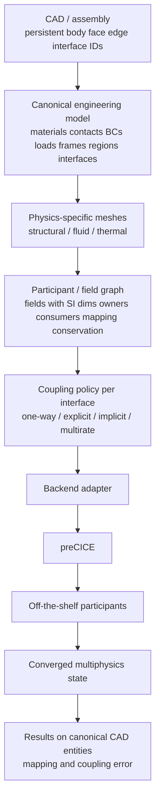
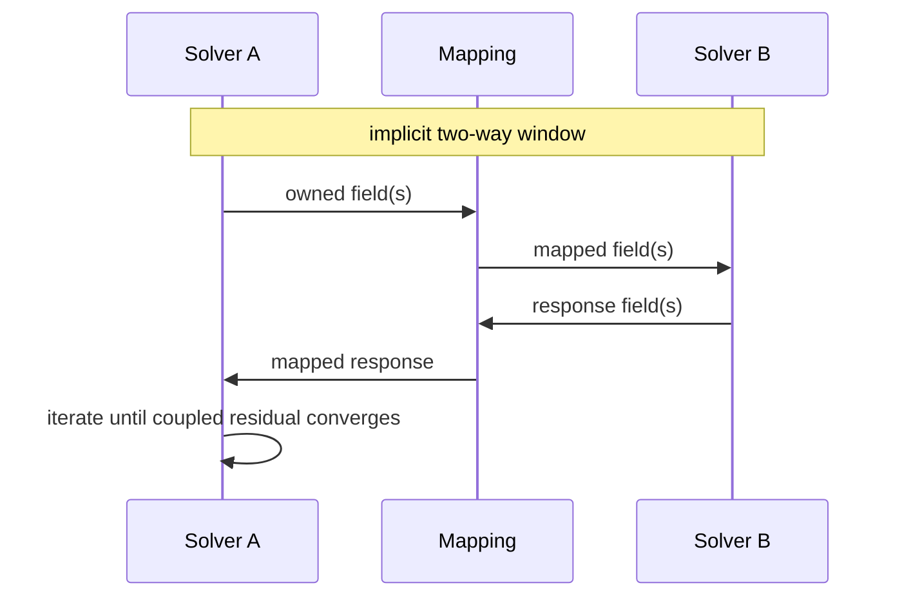

# feat: Phase E — CAD-native geometry to general coupled analysis

## Goal Capsule

Move from a **validated multiphysics stack** (A sequential, B weak-map, C idle coupler, D tight damper FSI on surrogate hexes) to a **general CAD-to-coupled-analysis system**.

Authority: user 2026-09-25 after D merge. D stays the damper product proof. Phase E does not retune D bands or replace preCICE with a homegrown coupler.

Stop when an imported CAD/assembly with stable topology identity is independently meshed per physics, executed as a participant/field graph through two or more off-the-shelf solvers with strongly converged coupling on **three field families** (mechanical displacement↔traction, thermal temperature↔heat flux, and those combined on the same model), and results are reconciled onto the original CAD entities with SI-consistent, traceable mapping/coupling error.

---

## Product Contract

### Summary

Phase E is the transition layer: persistent CAD identity, a canonical engineering model, physics-specific discretizations, a solver-agnostic field graph, partitioned coupling with a selectable policy per interface, and results mapped back to CAD — not another damper hex special case.

### Requirements

- R1. Import actual CAD/B-rep (assembly allowed). Do not generate the E demonstration geometry from damper sandwich writers (`d_fsi_meshes`, `c_fsi_meshes`, `write_solid_inp` hex bricks).
- R2. Preserve stable topology identity: body, face, edge, and coupling-interface IDs that survive remesh. Coupled interfaces are related by **canonical CAD face identity**, not coincident node numbers.
- R3. Canonical engineering model holds materials, contacts/joints, BCs/loads, frames, physics regions, and coupling interfaces. Loads and BCs are first-class on CAD entities, not hardcoded CLOAD lists in a scenario module.
- R4. Independent discretization per physics: structural tet/hex, CFD volume with boundary-layer awareness, thermal reuse or its own mesh. Common geometry identity; conservative mapping between discretizations.
- R5. The core abstraction is the **field**, not the solver. Each field carries: field_id, physical quantity, scalar/vector/tensor, SI dimensions, coordinate frame, spatial support, CAD entity/region, owner participant, consumer participants, time/state, mapping method, conservation requirement, convergence criterion.
- R6. Participant graph is solver-agnostic. CalculiX, OpenFOAM, a thermal participant, and future adapters consume the same field contract. Do not add FSI-only or thermal-only orchestration pathways that bypass the field graph.
- R7. Coupling policy is per interface: one-way, explicit two-way, implicit two-way (default when two-way interaction matters), multirate implicit. Strong implicit partitioned coupling is the default for two-way physics.
- R8. Backend boundary: Phase E contract → coupling policy → backend adapter → preCICE. Phase E is not preCICE. Replacing the backend later must not rewrite the canonical model or field schema.
- R9. Converged multiphysics state maps back onto canonical CAD entities with quantified mapping error and coupling residual, SI-consistent.
- R10. DoD demonstration uses **three interacting field families on one model**: (1) mechanical displacement↔traction, (2) thermal temperature↔heat flux, (3) fluid/thermal/mechanical combined. A second FSI-only example does not finish E.
- R11. `--coupling c` and `--coupling d` remain regression. E is a new CLI/scenario token. Garbage coupling tokens stay `broken`.
- R12. Hosted CI does not certify the Ubuntu live couple. Pytest owns schema, mapping conservation, identity stability, and fake-participant graph tests. Ubuntu owns the live three-family run.

### Actors

- A1. Operator imports CAD into an etools project and runs the E scenario on the Ubuntu reference VM (same CalculiX / ESI OpenFOAM / libprecice3 locators as C/D).
- A2. Implementer extends the C façade pattern: contract and adapters stay thin; E owns CAD identity, field graph, and policy.

### Key Flows

- F1. CAD/assembly in → persistent IDs → canonical engineering model.
- F2. Model → physics-specific meshes keyed by those IDs (non-conformal allowed).
- F3. Field graph + per-interface coupling policy → backend adapter → concurrent participants.
- F4. Window iteration until coupled residual converges (implicit two-way) or one-way/explicit as declared.
- F5. Results and error metrics written onto CAD entities / probe rows in the project artifact tree.

### Acceptance Examples

- AE1. Two different meshes of the same CAD face pair still couple: mapping is identity-based; equal node counts are not required.
- AE2. Declaring `solid.displacement` [m] and `fluid.traction` [Pa] uses the same field machinery as `temperature` [K] and `heat_flux` [W/m²].
- AE3. Interface policy `one-way` does not iterate a residual loop; `implicit two-way` does until convergence or fail-closed.
- AE4. A load applied to a named CAD face appears in the solid participant without editing a damper CLOAD writer.
- AE5. Ubuntu combined thermo-fluid-structural run exits 0 with finite mapped CAD-face results and reported mapping/coupling error; D damper scenario still passes.

### Scope Boundaries

**In scope:** CAD/B-rep import with stable IDs; canonical model; independent meshing; field graph; coupling policies; preCICE backend adapter; three-family demonstration; results-on-CAD; pytest + Ubuntu live gate.

**Deferred to follow-up work:** GUI; native 3DEXPERIENCE composition; MCP; species/mass-flux as a fourth DoD family; arbitrary commercial solvers beyond the existing kernel set; making E the default `damper-keyway` command.

**Outside this product's identity:** Homegrown coupling engine replacing preCICE as the E contract; forcing conformal meshes; bit-identical results vs D; tet STEP for the D damper suite.

---

## Planning Contract

### Key Technical Decisions

- KTD1. Keep C/D as the validated stack. E is a new vertical (`--coupling e` or a named CAD scenario), not a rewrite of `d_fsi_meshes.py`. Rationale: D proved kernels and tight FSI; E must not regress that proof.
- KTD2. CAD identity source is Open CASCADE via the existing FreeCAD locator (`FreeCADCmd`), exporting persistent face/body hashes or named topological IDs into the canonical model. Rationale: FreeCAD is already a doctor/hello tool; 3DX GUI stays parked.
- KTD3. Meshing: Gmsh (or FreeCAD FEM mesh) for solids; snappyHexMesh / cfMesh-class OpenFOAM meshing for BL-aware fluid volumes from the same CAD faces. Rationale: independent discretization is the E rule.
- KTD4. Mapping: conservative projection between interface tessellations keyed by CAD face ID (preCICE mapping configured from E policy, not node-number identity). Rationale: user rule — common geometry identity, independent discretization.
- KTD5. Field schema is the E contract module. Solver adapters only translate fields to CalculiX / OpenFOAM / thermal participant I/O. Rationale: generalize the field, not the solver.
- KTD6. Coupling policies map to preCICE configurations (serial-explicit, serial-implicit + Aitken on the second-to-first data, min-iterations, time window / multirate). Rationale: established C/D preCICE 3 XML; do not invent a second coupler.
- KTD7. Thermal participant is an off-the-shelf solver already in the suite (CalculiX heat transfer and/or OpenFOAM energy), not a new thermal code. Combined demo uses three participants if needed (Solid, Fluid, Thermal) or two participants carrying multiple field pairs on the same graph. Rationale: prove multiple independent field pairs without special-case pathways.
- KTD8. Demonstration CAD is a small real B-rep (multi-body or multi-face assembly) checked into `src/engineering_tools/data/` or generated once by FreeCAD script that writes STEP **and** identity JSON — not parametric hex sandwich. Rationale: "beyond parameter-generated surrogate geometry."

### Assumptions

- Ubuntu hhpe-forge locators from C/D remain the live gate.
- ESI OpenFOAM pimpleFoam / energy-capable foam, `ccx_preCICE`, libprecice3 stay first kernels.
- Conservative mapping error is reported even when coupling residual is small.
- Species / mass flux stay schema-legal field types but are not required in the E live DoD.

### High-Level Technical Design

---

## Implementation Units

### U1. Canonical model and field schema

**Goal:** Persist the engineering model and field records without a solver.
**Requirements:** R3, R5, R6
**Dependencies:** none
**Files:**
- Create: `src/engineering_tools/e_model.py`
- Create: `src/engineering_tools/e_field.py`
- Test: `tests/test_e_model.py`
**Approach:** JSON-serializable model: entities (body/face/edge/interface), materials, loads/BCs on entity IDs, physics regions, coupling interfaces. Field records with the property list in R5. Reject missing SI dimensions or missing CAD support.
**Patterns to follow:** `c_contract.py` fail-closed tokens; damper params as data not as the E model.
**Test scenarios:**
- Happy: round-trip JSON preserves face IDs and two field records (displacement, traction).
- Edge: tensor vs vector kind mismatch fails closed.
- Error: field without owner participant is invalid.
**Verification:** pytest on schema only; no solvers.

### U2. CAD import with stable topology identity

**Goal:** Import B-rep and emit identity JSON that remesh does not rewrite.
**Requirements:** R1, R2, AE1
**Dependencies:** U1
**Files:**
- Create: `src/engineering_tools/e_cad.py`
- Create: `src/engineering_tools/data/e-demo/` (STEP + identity fixture)
- Test: `tests/test_e_cad.py`
**Approach:** FreeCADCmd script reads STEP, assigns stable IDs (named faces or hashed topology independent of mesh). Second import of the same STEP yields the same IDs. Do not call `write_d_solid_inp`.
**Patterns to follow:** `hello_probes.probe_freecad` / `damper_scenario` FreeCAD invocation, without damper probe tables as identity.
**Test scenarios:**
- Happy: fixture STEP yields ≥2 faces with stable IDs.
- Integration: import twice, ID sets equal.
- Error: missing FreeCAD is `missing` not a silent hex fallback.
**Verification:** pytest with fixture; skip-or-missing if FreeCAD absent in CI.

### U3. Physics-specific meshing keyed by CAD face IDs

**Goal:** Produce independent solid and fluid meshes that both name the same interface face IDs.
**Requirements:** R4, AE1
**Dependencies:** U2
**Files:**
- Create: `src/engineering_tools/e_mesh.py`
- Test: `tests/test_e_mesh.py`
**Approach:** Solid mesh and fluid mesh writers take canonical face IDs. Node counts may differ. Mesh artifacts store face-ID → element/node sets. No requirement that interface nodes coincide.
**Patterns to follow:** OpenFOAM case layout from `c_adapter_openfoam.py`; CalculiX NSET naming from C (`NinterfaceN`) but generated from CAD IDs not sandwich planes.
**Test scenarios:**
- Happy: two meshes, same interface face ID, unequal node counts.
- Error: mesh missing a declared coupling face fails closed.
**Verification:** pytest on written mesh metadata; live meshing on Ubuntu in U6+.

### U4. Mapping and conservation on the field graph

**Goal:** Conservative mapping between discretizations for a field pair.
**Requirements:** R4, R5, R9, AE1
**Dependencies:** U1, U3
**Files:**
- Create: `src/engineering_tools/e_mapping.py`
- Test: `tests/test_e_mapping.py`
**Approach:** Given two tessellations of one CAD face, map a constant field and assert integral conservation within a documented tolerance. Record mapping error on the field record. Mapping method is data on the field, not a solver if-branch.
**Test scenarios:**
- Happy: constant pressure maps with conserved integral.
- Edge: empty consumer mesh fails closed.
- Error: unknown mapping method is `broken`.
**Verification:** pytest with synthetic tessellations.

### U5. Coupling policy and preCICE backend adapter

**Goal:** Compile per-interface policy to preCICE XML without making E equal preCICE.
**Requirements:** R7, R8, AE2, AE3
**Dependencies:** U1
**Files:**
- Create: `src/engineering_tools/e_policy.py`
- Create: `src/engineering_tools/e_backend_precice.py`
- Modify: `src/engineering_tools/c_backend_precice.py` only if sharing XML helpers without changing C/D defaults
- Test: `tests/test_e_policy.py`
**Approach:** Policy enum: one-way, explicit two-way, implicit two-way, multirate implicit. Backend module generates config from the field graph. Aitken only on data from second participant to first (C/D lesson). C `default_policy` and D `tight_d_policy` stay.
**Patterns to follow:** `c_backend_precice.generate_precice_config`, preCICE 3, Force not Traction for OF adapter.
**Test scenarios:**
- Covers AE3. one-way XML has no implicit coupling loop markers that D uses; implicit two-way includes relative-convergence-measure and min-iterations ≥ 2.
- Happy: two field pairs (displacement/traction and temperature/heat flux) appear as distinct exchanges in one config.
- Error: Displacement Aitken on serial-implicit first-to-second data is rejected.
**Verification:** pytest on generated XML strings.

### U6. Mechanical CAD FSI (displacement ↔ traction)

**Goal:** Live two-participant FSI on imported CAD, not damper hex.
**Requirements:** R1, R10 family 1, AE4, AE5 (partial)
**Dependencies:** U2, U3, U4, U5
**Files:**
- Create: `src/engineering_tools/e_facade.py`
- Modify: `src/engineering_tools/cli.py`, `src/engineering_tools/c_cli.py` (E token)
- Test: `tests/test_e_fsi.py`
**Approach:** Wire CalculiX + OpenFOAM participants from the field graph. Loads from canonical model faces. Reuse adapter process launch from `c_facade._run_partitioned_fsi` without D mesh writers.
**Execution note:** Fake participants in pytest; Ubuntu live mechanical pair before adding thermal.
**Test scenarios:**
- Happy: fake couple persists E session `ok` when residuals complete and CAD-face traction is finite.
- Error: zeros on traction vs declared finite load fail-closed.
- Covers AE4. face-tagged load is present in solid input.
**Verification:** pytest fakes; Ubuntu mechanical green is a gate for U8 not a substitute for U8.

### U7. Thermal field pair (temperature ↔ heat flux)

**Goal:** Same machinery carries a thermal exchange.
**Requirements:** R5, R6, R10 family 2, AE2
**Dependencies:** U5, U6
**Files:**
- Modify: `src/engineering_tools/e_field.py`, `src/engineering_tools/e_facade.py`, adapters as needed
- Test: `tests/test_e_thermal.py`
**Approach:** Add temperature and heat_flux fields on CAD faces. Thermal participant is CalculiX heat transfer and/or OpenFOAM energy — still graph-driven. No `run_thermal_special()` path that skips `e_field`.
**Test scenarios:**
- Covers AE2. constructing thermal fields uses the same validate/serialize path as mechanical fields.
- Happy: policy implicit two-way for heat flux residual.
- Error: mixing Pa traction onto a temperature consumer fails closed on SI dimensions.
**Verification:** pytest schema + fake participant; Ubuntu optional smoke if U8 will cover live thermal.

### U8. Combined thermo-fluid-structural on one CAD model

**Goal:** E DoD demonstration: three field families, results back on CAD, quantified error.
**Requirements:** R9, R10, R11, R12, AE5
**Dependencies:** U6, U7
**Files:**
- Create: `src/engineering_tools/e_scenario.py`
- Create: `src/engineering_tools/data/e-demo/e-bands.json` (frozen after first Ubuntu green)
- Modify: scenario CLI dispatch next to `damper_scenario.py`
- Test: `tests/test_e_scenario.py`
**Approach:** One imported model, multiple field pairs in one graph, strong implicit where two-way, map state back to face IDs. Freeze bands after first Ubuntu green; second run accepts. `--coupling d` still passes on the damper project.
**Execution note:** Ubuntu is the live DoD. Fail-closed if coupling residual green but CAD-mapped fields are ~0 while loads/BCs are finite.
**Test scenarios:**
- Happy: fake three-pair graph writes CAD-entity result rows for displacement, traction, temperature, heat flux.
- Covers AE5. D regression test still invokes damper `--coupling d` path.
- Error: missing thermal pair in the combined scenario is `broken` (DoD incomplete).
**Verification:** pytest fakes + D regression; Ubuntu combined run twice (calibrate, accept).

---

## Verification Contract

- Pytest: `tests/test_e_model.py`, `tests/test_e_cad.py`, `tests/test_e_mesh.py`, `tests/test_e_mapping.py`, `tests/test_e_policy.py`, `tests/test_e_fsi.py`, `tests/test_e_thermal.py`, `tests/test_e_scenario.py`, plus existing `tests/test_d_fsi.py` and `tests/test_c_fsi.py` remain green.
- Ubuntu: import E demo STEP; run E combined scenario; freeze `e-bands.json`; second clean run; `etools scenario damper-keyway --coupling d` still ok.
- Mapping: report integral conservation error per coupled CAD face.
- Coupling: report window residuals per field pair.

---

## Definition of Done

- An arbitrary **supported** CAD/assembly (the E demo B-rep, not only damper params) imports with stable topology IDs.
- Independent meshes exist for at least structural and fluid; thermal has its own or a declared reuse.
- Canonical participant/field graph executes through two or more off-the-shelf solvers.
- Strong implicit coupling converges where two-way policy is set.
- Three field families demonstrated on the same model.
- Results reconciled to CAD entities with SI-consistent values and quantified mapping/coupling error.
- C and D remain passing proofs of the stack, not the E product.

---

## Risks and Dependencies

- CAD ID stability across FreeCAD versions is a known OCCT risk; pin identity algorithm and fixture hashes in tests.
- OpenFOAM adapter field names (Force vs Traction) already bit C; E must not reintroduce Traction.
- Three live participants increase preCICE XML and MPI surface area; fail-closed on participant death, same as C.
- Thermal + FSI on one model may need smaller windows than D; policy/multirate exists so D time steps are not copied blindly.

## Open Questions

- Q1 (deferred, non-blocking): whether the combined demo uses two participants with multiple field pairs or three processes. Implementer picks the smallest graph that still has independent field pairs and no special-case pathway.
- Q2 (deferred): exact E CLI token (`--coupling e` vs `etools scenario cad-coupled`). Must not alias `--fsi` (that remains C).

## Sources and Research

- User architecture 2026-09-25 (CAD identity, independent discretization, field-centric contract, preCICE as backend).
- Landed D: merge `5877ca0` / PR 7 on `feat/multi-tool-workflows`.
- Local patterns: `c_facade.py`, `c_backend_precice.py`, `d_fsi_meshes.py` (negative example for E geometry).
- External research was not run; preCICE and kernel versions are taken from the C/D Ubuntu freeze.
