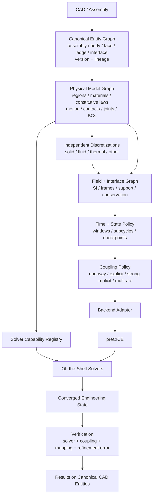

# feat: Phase E — general CAD-native engineering analysis

## Goal Capsule

Move from a **validated multiphysics stack** (A sequential, B weak-map, C coupling contract, D tight damper FSI) to a **general CAD-native engineering analysis architecture**.

Phase E is not another FSI implementation and does not define the system in terms of "solid + fluid + thermal" as fixed product categories.

The authoritative model is:

**CAD entities → physical regions → physics/constitutive models → discretizations → solver participants → fields/interfaces → coupled state → results on canonical entities.**

A physical region may be rigid, deformable, elastic, plastic, viscoelastic, brittle/damage-capable, thermal, incompressible fluid, compressible gas, multiphase, rotating, or another future physics type. The orchestration architecture must not require redesign when a new physics solver or constitutive model is added.

Authority: user 2026-09-25 after D merge. D remains the damper product proof. Phase E does not retune D bands or replace preCICE with a homegrown coupler.

### Phase E architectural end goal

Given a supported CAD project or assembly, the system shall be able to:

1. preserve geometric, assembly, and topology identity;
2. assign physical regions, materials, constitutive behavior, motion, contacts, loads, and BCs;
3. generate or consume physics-appropriate independent discretizations;
4. assign those regions to compatible off-the-shelf solver participants;
5. exchange arbitrary typed physical fields between participants;
6. strongly couple interacting physics where required;
7. advance participants consistently across their required time scales;
8. preserve/restore participant state when iterative coupling requires rollback;
9. reconcile results onto the original canonical engineering entities;
10. quantify solver convergence, coupling convergence, mapping conservation, and discretization sensitivity.

The architectural criterion for generality is:

> Any engineering analysis expressible as physical regions, constitutive/physics models, fields, interfaces, state, and solver participants can be added without redesigning the Phase E core.

Phase E does **not** claim that every possible engineering physics model is implemented in this shipment. Unsupported models must be identifiable through capabilities and fail closed.

### Shipment stop condition

Stop Phase E when:

- a real imported CAD/assembly is represented through the general model rather than a damper-specific geometry path;
- non-conformal physics meshes share canonical CAD identity;
- the field/coupling machinery handles mechanical and thermal exchanges without special-case orchestration;
- a **compressible gas region** participates in the live coupled model;
- deformable structural response, thermal exchange, and compressible fluid behavior are solved through off-the-shelf kernels;
- at least one rigid/prescribed-motion region is represented through the same canonical model;
- strongly coupled windows converge with checkpoint/rollback semantics available where required;
- results map back to canonical CAD entities;
- conservation/mapping errors and coupling residuals are recorded;
- at least one mesh/time refinement comparison demonstrates that selected engineering outputs are within declared numerical sensitivity bands.

This is the reference proof of the general architecture, not the limit of the physics it can later host.

---

# Product Contract

## Summary

Phase E introduces the general engineering-physics layer:

```text
CAD / assembly
      ↓
Canonical entity graph
      ↓
Physical-region / constitutive graph
      ↓
Physics-specific discretizations
      ↓
Participant capability assignment
      ↓
Field + interface graph
      ↓
Coupling/time/state policy
      ↓
Backend(s)
      ↓
Off-the-shelf solvers
      ↓
Reconciled engineering state
      ↓
Results on original CAD entities
```

The central abstractions are **physical region, field, interface, state, and capability**, not solver names.

---

## Requirements

### Geometry and identity

- **R1.** Import actual CAD/B-rep; assemblies are allowed. Phase E demonstration geometry shall not come from D/C surrogate hex writers.
- **R2.** Maintain canonical IDs for assemblies, bodies, faces, edges, regions, contacts, joints, and coupling interfaces.
- **R3.** Identity must survive remeshing and solver-specific discretization.
- **R4.** CAD edits create a new topology version. Phase E records entity lineage/rebinding explicitly rather than claiming arbitrary CAD edits preserve raw OCCT topology identifiers automatically.
- **R5.** Solver meshes reference canonical CAD entities; canonical identity does not depend on equal node counts or coincident interface nodes.

### Canonical engineering model

- **R6.** The model owns materials, BCs, loads, contacts, joints, frames, physical regions, motion definitions, physics models, constitutive models, coupling interfaces, and solver assignments.
- **R7.** Loads/BCs attach to canonical entities, not hardcoded solver input records.
- **R8.** Frame identity and units remain distinct. Canonical numerical exchange is SI; adapters perform unit conversion.
- **R9.** Every model/state artifact is versioned and traceable to CAD version, mesh version, solver configuration, and material/model data.

### Physical regions and constitutive models

- **R10.** Physical regions are first-class and may declare one or more physics models.

Examples include:

```text
rigid_body
deformable_solid
incompressible_fluid
compressible_fluid
thermal_solid
porous_region
future physics model
```

- **R11.** Structural constitutive behavior is model data, not an orchestration special case.

Schema must be able to represent, at minimum:

```text
linear_elastic
temperature_dependent_elastic
elastoplastic
temperature_dependent_plastic
hyperelastic
viscoelastic
creep
damage/brittle
composite/anisotropic
rigid
```

Implementation support is declared separately through solver capabilities.

- **R12.** Constitutive internal state remains solver-owned unless explicitly exchanged. The canonical session records provenance and restart/checkpoint state sufficient to reproduce coupled advancement.
- **R13.** An adapter must reject a model that its solver does not support. It may not silently downgrade an elastoplastic, brittle, compressible, thermal, or other requested model.

### Gas and fluid representation

- **R14.** Gas is represented as a **compressible-fluid physical region**, not as a special product path.

Its declared state/model may include:

```text
pressure
density
temperature
velocity
enthalpy/internal energy
species fractions
equation of state
transport model
turbulence model
```

- **R15.** Incompressible and compressible fluids share the region/field architecture; the selected solver capability determines the governing formulation.
- **R16.** Pressurized closed volumes, flowing gas systems, and rotating machinery must be representable without changing the core schema.
- **R17.** Motion is a first-class region/interface property:

```text
fixed
prescribed rigid motion
solved rigid-body motion
deformable motion
rotating reference frame
sliding/moving mesh
```

This is the basis for later compressor, turbine, pump, piston, rotor/stator, and mechanism analyses.

### Thermally affected bodies

- **R18.** Thermal behavior is not a separate orchestration mode. Temperature and heat-transfer fields operate through the same field/interface machinery.
- **R19.** Material models may depend on temperature, including properties such as:

```text
E(T)
nu(T)
yield(T)
alpha(T)
k(T)
Cp(T)
rho(T)
creep/damage parameters(T)
```

- **R20.** Thermoelastic, thermoplastic, thermal-expansion, thermal-stress, and conjugate-heat-transfer problems therefore use combinations of existing region, constitutive, and field definitions.

### Field contract

- **R21.** Field is the principal coupling abstraction.

Each field records:

```text
field_id
physical quantity
scalar / vector / tensor
SI dimensions
coordinate frame
spatial support
canonical entity / region
owner participant
consumer participant(s)
time/state index
mapping method
intensive / extensive semantics
conservation requirement
convergence criterion
```

Examples:

```text
displacement            [m]
traction                [Pa]
force                   [N]
pressure                [Pa]
velocity                [m/s]
temperature             [K]
heat_flux               [W/m²]
density                 [kg/m³]
enthalpy                [J/kg]
species_mass_fraction   [-]
```

- **R22.** Mechanical, thermal, fluid, species, electromagnetic, acoustic, and future field types must use the same registration/mapping/exchange contract when their adapters are implemented.

### Interfaces and relations

- **R23.** Interface definitions connect canonical physical regions, not solver meshes directly.
- **R24.** An interface may carry multiple simultaneous field relationships.

Example:

```text
fluid ↔ wall

displacement ↔ traction
temperature  ↔ heat_flux
```

- **R25.** Contacts, joints, connectors, fluid-solid interfaces, thermal interfaces, and future coupling relations are distinct typed relations on the canonical graph.

### Independent discretization

- **R26.** Each physics participant may have its own mesh/discretization.
- **R27.** Structural, CFD, thermal, rigid/contact, or other participants need not share nodes.
- **R28.** CFD meshing shall support boundary-layer-aware refinement where required by the selected model.
- **R29.** Coupled interfaces map through canonical entity identity and geometric projection.
- **R30.** Mapping semantics distinguish intensive and extensive quantities so conservation requirements are explicit.
- **R31.** Mapping error/integral conservation error is reported independently of solver/coupling residual.

### Solver capabilities

- **R32.** Each solver adapter publishes a machine-readable capability record.

At minimum:

```text
supported physical-region types
supported constitutive models
supported field I/O
steady/transient support
compressible/incompressible capability
thermal capability
moving mesh capability
rigid/contact capability
checkpoint/restore capability
topology-change capability
supported discretizations
```

- **R33.** Participant assignment is validated against the capability registry before launch.
- **R34.** Initially, solver selection may be explicit. Future automatic solver selection may operate on the same capability records without changing the canonical model.

### Coupling

- **R35.** Coupling policy is declared per interface/field relationship:

```text
one-way
explicit two-way
implicit two-way
multirate implicit
```

- **R36.** Strong implicit partitioned coupling is the default when two-way interaction materially affects both participants.
- **R37.** Phase E policy is authoritative. Backend configuration is generated.
- **R38.** Architecture remains:

```text
Phase E contract
      ↓
coupling policy
      ↓
backend adapter
      ↓
preCICE
```

not:

```text
Phase E = preCICE
```

- **R39.** If a requested coupling policy cannot be realized by the selected backend/participants, execution fails closed rather than silently falling back to weaker coupling.

### Time, state, checkpoint, and rollback

- **R40.** Time/state are first-class and participant-specific.
- **R41.** Participants may subcycle or advance at different time rates where policy permits.
- **R42.** Coupling windows, solver timesteps, and global analysis time are distinct quantities.
- **R43.** Checkpoint/restore is part of the general participant contract where implicit coupling or nonlinear/irreversible material state requires it.
- **R44.** Plasticity, damage, creep, moving geometry, and other history-dependent participants must not accumulate coupling-iteration state incorrectly. They restore the proper window-start state before reevaluation where required.
- **R45.** Very long physical horizons are supported by appropriate model decomposition/time scales; Phase E does not require every 3-D solver to march at the smallest timestep for the entire horizon.

### Topology evolution

- **R46.** Canonical entities carry a `topology_version`.
- **R47.** The schema must be capable of describing a topology-change/remesh event and entity lineage.
- **R48.** Dynamic crack propagation, erosion, ablation, phase-boundary topology mutation, and similar operations may remain **specified/unavailable** in the first Phase E shipment.
- **R49.** Requesting unavailable topology mutation fails closed; it is not approximated as fixed topology.

### Reconciliation and verification

- **R50.** Results map back onto canonical CAD entities.
- **R51.** Reconciled outputs retain units, frame, time/state, source participant, mesh version, mapping method, and provenance.
- **R52.** Phase E separately reports:

```text
solver convergence
coupling convergence
mapping/conservation error
mesh/discretization sensitivity
time-step sensitivity where applicable
```

- **R53.** "High definition" is not defined solely by mesh density. Critical engineering outputs must show declared numerical sensitivity/convergence behavior under at least one refinement.

### Regression/product behavior

- **R54.** Existing C/D proofs remain regression tests and are not rewritten as E.
- **R55.** E receives a distinct scenario/analysis token.
- **R56.** Unknown capability/coupling/model IDs are `broken`; known but unavailable capabilities are `missing`.
- **R57.** No requested Phase E capability may silently skip.

---

## Actors

- **A1. Operator:** imports CAD/assembly, declares engineering model and analysis, executes on supported Ubuntu environment.
- **A2. Implementer:** adds model/field/solver adapters without creating solver-specific product pathways.
- **A3. Solver adapter:** translates canonical regions, fields, BCs, materials, state, and discretizations to/from one external solver.
- **A4. Coupling backend:** realizes an already-declared coupling policy; it does not own product semantics.

---

## Key Flows

### F1. Geometry

```text
CAD/assembly
→ canonical entity IDs
→ topology version + lineage
→ canonical engineering model
```

### F2. Physics definition

```text
canonical entities
→ physical regions
→ materials
→ constitutive/physics models
→ motion/contact/joint definitions
```

### F3. Solver assignment

```text
physical model requirements
→ participant capability validation
→ solver assignments
```

### F4. Discretization

```text
canonical regions
→ physics-specific meshes
→ mesh/entity bindings
```

### F5. Coupling

```text
field/interface graph
→ coupling + time/state policy
→ backend compiler
→ participant execution
```

### F6. Reconciliation

```text
native solver fields
→ canonical SI fields
→ CAD entity mapping
→ convergence/conservation/error metrics
→ project artifact state
```

---

# Acceptance Examples

- **AE1.** Two independent meshes of one CAD face couple correctly despite different node counts.
- **AE2.** A structural region may change from linear-elastic to elastoplastic without changing orchestration code; only the model and compatible adapter capability change.
- **AE3.** A ceramic/brittle material declaration is accepted by the canonical model but fails `missing`/unsupported if the selected solver adapter does not advertise the requested damage/fracture model.
- **AE4.** A rigid body and deformable body may coexist in the same CAD assembly.
- **AE5.** A pressurized gas region declares compressible-fluid state and EOS/thermal information rather than being represented as incompressible cavity pressure.
- **AE6.** A gas-filled deformable vessel can exchange traction/displacement and temperature/heat-flux on the same wall interface.
- **AE7.** A rotating region can declare prescribed rotation or a rotating-frame/moving-mesh requirement; an incompatible fluid adapter fails before launch.
- **AE8.** Temperature-dependent structural material properties consume the thermal state through canonical fields, without a `thermal_special_case` orchestration path.
- **AE9.** Constant pressure mapped between non-conformal interface meshes conserves integrated force within declared tolerance.
- **AE10.** `one-way` coupling does not iterate; `implicit two-way` iterates until convergence or fails closed.
- **AE11.** A participant with irreversible internal state is checkpointed/restored correctly across implicit coupling iterations.
- **AE12.** Refining the live demonstration mesh produces selected engineering quantities within the declared sensitivity band.
- **AE13.** Existing D damper scenario remains green.

---

# Scope Boundaries

## In scope

- CAD/B-rep and assembly import.
- Versioned canonical topology identity.
- Physical-region model.
- Materials and constitutive-model declarations.
- Solver capability registry.
- Independent physics-specific meshing.
- General field/interface graph.
- Rigid/deformable/compressible-fluid/thermal model representation.
- Prescribed motion/rotating-region representation.
- Mechanical + thermal field coupling.
- Compressible gas in the Phase E live proof.
- Strong implicit partitioned coupling.
- Multirate/time-state contract.
- Checkpoint/rollback contract and implementation where required by the live graph.
- preCICE backend.
- Results on CAD.
- Mapping/conservation metrics.
- Mesh/time sensitivity infrastructure.
- Fake tests for additional schema-legal physics.

## Specified but not necessarily live in first Phase E proof

- Advanced plasticity families beyond selected kernel support.
- Brittle damage/fracture propagation.
- Dynamic topology mutation/remeshing.
- Multiphase/free-surface flow.
- Cavitation/boiling/condensation.
- Species transport/reaction/combustion.
- Electromagnetics.
- Acoustics.
- DEM.
- Full rigid-body mechanism solver backend.
- 0-D/1-D system-model participants.
- Arbitrary external/commercial solvers.

These remain valid architectural capabilities. They must fail closed until an adapter and model implementation advertise support.

## Outside Phase E's identity

- A homegrown coupling engine replacing preCICE merely to satisfy the architecture.
- Treating preCICE XML as source of truth.
- Forcing all physics onto one conformal mesh.
- Defining generality as `solid + fluid`.
- Claiming every solver supports every constitutive model.
- Silently simplifying requested physics.
- Requiring bit-identical results between different numerical schemes.
- Rewriting D to become E.

---

# Planning Contract

## Key Technical Decisions

### KTD1. General model above solver categories

The canonical layer models physical regions, constitutive behavior, fields, relations, and state. "Solid", "fluid", and "thermal" are model capabilities, not top-level product pathways.

### KTD2. Versioned CAD identity

Use Open CASCADE/FreeCAD as the initial geometry source, but do not equate raw OCCT topology numbering with permanent engineering identity.

Persist:

```text
entity_id
geometry fingerprint
parent/assembly relation
topology_version
entity lineage/rebinding metadata
```

Remeshing must preserve canonical IDs. Geometry modification produces a new topology version and explicit rebinding.

### KTD3. Solver capability registry

Every adapter must publish what it can actually solve. Model validation occurs before process launch.

This prevents cases such as:

```text
requested: brittle damage + crack propagation
selected adapter: linear-elastic-only capability
```

from silently producing a meaningless result.

### KTD4. Constitutive evaluation remains inside specialist solvers

Phase E describes and validates constitutive intent. It does not independently reimplement plasticity, ceramics, creep, hyperelasticity, gas EOS, turbulence, etc.

### KTD5. Gas is compressible-fluid state

Gas regions carry thermodynamic model declarations and are assigned to an energy/compressibility-capable fluid solver.

A pressurized container and a compressor therefore use the same canonical fluid-region model with different geometry, motion, BCs, and solver capabilities.

### KTD6. Motion is orthogonal to material/physics

A region may simultaneously be:

```text
compressible fluid + rotating frame
deformable solid + temperature dependent
rigid body + prescribed rotation
```

Motion/kinematics is not encoded by inventing new material categories.

### KTD7. Independent discretization

Use appropriate mesh generation per participant.

Initial preferred stack:

- Gmsh / FreeCAD-supported meshing for structural/thermal volume meshes where appropriate.
- OpenFOAM meshing for fluid domains with boundary-layer/local refinement.
- Canonical entity-to-mesh binding artifacts for every discretization.

### KTD8. Conservative field mapping

Mapping is selected from field semantics.

Examples:

- displacement/temperature: consistent interpolation;
- traction/pressure/heat flux: conservation-aware transfer where appropriate;
- integrated force/heat balance reported explicitly.

### KTD9. Field graph is solver independent

No `run_fsi_special()` / `run_thermal_special()` / `run_gas_special()` orchestration branches.

The canonical field graph drives adapters.

### KTD10. Strong implicit is the high-coupling default

For materially two-way interaction, use converged partitioned iteration with acceleration as supported.

One-way and explicit coupling remain valid declared policies when physically appropriate.

### KTD11. Checkpoint/rollback is promoted to core Phase E

This is required for rigorous iteration with nonlinear/history-dependent states.

Participants advertise checkpoint/restore capability. Policies requiring it reject participants unable to supply it.

### KTD12. preCICE remains a backend

Generated configuration only.

```text
E model
→ E policy
→ preCICE backend compiler
→ generated config
→ participant processes
```

### KTD13. Generality is measured by model portability

A physical model should be transferable to another compatible adapter without changing its canonical entity/field definitions.

### KTD14. High definition is verified, not assumed

At least one live E result must be repeated under spatial and/or temporal refinement.

The artifact records:

```text
baseline output
refined output
relative difference
declared tolerance
```

---

# High-Level Technical Design



### Representative heated pressurized vessel / compressor-style graph

```text
Compressible gas region
  p, rho, T, u, h
        │
        ├── traction ─────────────► deformable structure
        │                              │
        │◄──── displacement ───────────┘
        │
        ├── heat flux ─────────────► thermal/structural region
        │◄──── temperature ────────────┘
        │
        └── moving/rotating boundary relationship
                    ↕
              rigid/deformable component
```

A future compressor uses the same architecture with:

```text
compressible gas
+ rotating/moving fluid region
+ rotor/stator solids
+ pressure/traction coupling
+ thermal coupling
+ temperature-dependent materials
+ optional rigid-body/system participant
```

No new core orchestration type is required.

---

# Implementation Units

## U1. Canonical entity, region, and physical-model schema

**Goal:** Represent engineering intent independently of any solver.

**Requirements:** R1-R25  
**Dependencies:** none

**Files:**
- Create: `src/engineering_tools/e_model.py`
- Create: `src/engineering_tools/e_region.py`
- Create: `src/engineering_tools/e_material.py`
- Create: `src/engineering_tools/e_field.py`
- Test: `tests/test_e_model.py`

**Approach:**

Implement JSON-serializable records for:

```text
assembly/entity
physical region
material
constitutive model
physics model
motion model
contact/joint
BC/load
field
interface
time/state
```

**Tests:**
- deformable elastoplastic solid is schema-valid;
- rigid body is schema-valid;
- compressible gas with EOS declaration is schema-valid;
- thermal material with `E(T)`/`k(T)` references is schema-valid;
- incompatible dimensions fail;
- missing owner/support fails;
- unsupported live capability does not make the model itself structurally invalid.

---

## U2. Solver capability registry

**Goal:** Separate architectural representability from implemented solver support.

**Requirements:** R32-R34

**Files:**
- Create: `src/engineering_tools/e_capabilities.py`
- Test: `tests/test_e_capabilities.py`

**Approach:**

Adapters publish capability JSON/types.

Initial registry covers existing available kernels and the capabilities needed for the Phase E demonstration.

**Tests:**
- compatible assignment succeeds;
- requested compressible fluid on incompressible-only adapter fails closed;
- unsupported constitutive model reports unavailable;
- checkpoint-required policy rejects adapter without restore support.

---

## U3. CAD import, topology version, and identity lineage

**Goal:** Produce canonical engineering entities independent of meshes.

**Requirements:** R1-R5

**Files:**
- Create: `src/engineering_tools/e_cad.py`
- Create: `src/engineering_tools/data/e-demo/`
- Test: `tests/test_e_cad.py`

**Approach:**

Import STEP/B-rep using FreeCAD/OCCT.

Persist deterministic project-level entity identity plus topology version/fingerprint.

Do not promise stable raw face numbering across arbitrary CAD edits.

**Tests:**
- identical geometry imports deterministically;
- remeshing does not change entity IDs;
- changed geometry creates a new topology version;
- unresolved entity rebinding fails closed.

---

## U4. General discretization graph

**Goal:** Generate independent physics-specific meshes bound to canonical entities.

**Requirements:** R26-R31

**Files:**
- Create: `src/engineering_tools/e_mesh.py`
- Test: `tests/test_e_mesh.py`

**Approach:**

Store:

```text
mesh_id
participant
source topology_version
entity → mesh-set binding
quality metrics
refinement settings
```

Fluid and structural interfaces need not coincide.

**Tests:**
- unequal interface node counts valid;
- missing canonical face binding invalid;
- stale topology-version mesh rejected.

---

## U5. General field mapping and conservation

**Goal:** Transfer arbitrary typed fields between non-conformal discretizations.

**Requirements:** R21-R31, R50-R52

**Files:**
- Create: `src/engineering_tools/e_mapping.py`
- Test: `tests/test_e_mapping.py`

**Tests:**
- constant pressure preserves integrated load;
- heat flux preserves integrated heat flow;
- displacement interpolation remains geometrically consistent;
- wrong dimensions fail;
- mapping error recorded independently from coupling residual.

---

## U6. Time/state/checkpoint contract

**Goal:** Support rigorous implicit and future multirate/history-dependent coupling.

**Requirements:** R40-R49

**Files:**
- Create: `src/engineering_tools/e_state.py`
- Create: `src/engineering_tools/e_time.py`
- Test: `tests/test_e_state.py`

**Approach:**

Participant states expose:

```text
time
window
iteration
checkpoint id
topology version
internal-state provenance
```

**Tests:**
- failed coupling iteration restores window-start participant state;
- irreversible fake participant demonstrates that state does not double-accumulate across iterations;
- multirate schedule compiles;
- unsupported topology mutation fails closed.

---

## U7. Coupling policy + backend compiler

**Goal:** Compile generic field relationships into backend configuration.

**Requirements:** R35-R39

**Files:**
- Create: `src/engineering_tools/e_policy.py`
- Create: `src/engineering_tools/e_backend_precice.py`
- Test: `tests/test_e_policy.py`

**Approach:**

Support:

```text
one-way
explicit two-way
implicit two-way
multirate implicit
```

Generated preCICE configuration remains an output artifact.

**Tests:**
- displacement/traction and temperature/heat-flux coexist;
- compressible-fluid field metadata does not require new orchestration path;
- invalid policy/backend combination fails;
- checkpoint requirement propagated.

---

## U8. General participant adapters

**Goal:** Translate canonical models into live solver inputs.

**Requirements:** R10-R20, R32-R34

**Files:**
- Create/extend adapter modules under a solver-neutral participant boundary.
- Test: `tests/test_e_adapters.py`

Initial live capabilities shall include:

### Structural participant

- deformable solid;
- temperature-dependent elastic response required for live proof;
- rigid/prescribed region representation where supported;
- traction/load consumption;
- displacement/stress/temperature output.

### Fluid participant

- compressible gas;
- energy equation;
- moving/deforming boundary;
- pressure/traction output;
- temperature/heat-transfer output.

Adapters own native solver syntax. Scenario/product code does not.

---

## U9. General Phase E façade/session

**Goal:** Execute the canonical graph without solver-specific scenario logic.

**Files:**
- Create: `src/engineering_tools/e_facade.py`
- Test: `tests/test_e_facade.py`

**Session artifact records:**

```text
CAD/topology version
physical regions
materials/models
participants
capabilities used
mesh versions
field graph
coupling policies
time windows
checkpoint events
solver convergence
coupling convergence
mapping error
canonical result rows
verification/refinement rows
status
```

---

## U10. Phase E live reference model

**Goal:** Demonstrate the general architecture rather than another narrow FSI case.

**Preferred reference class:**

A small real CAD assembly containing:

- compressible gas volume;
- deformable solid boundary/component;
- thermally active wall;
- at least one rigid or prescribed-motion component;
- named CAD interfaces;
- non-conformal fluid/structural discretizations.

The exact geometry may be a heated pressurized vessel / piston / rotor-style reference chosen for the smallest reliable runtime.

It must prove:

```text
compressible gas state
mechanical traction ↔ displacement
temperature ↔ heat flux
temperature-dependent solid response
real interface mesh motion
canonical CAD identity
results reconciled to CAD
```

This is a **thermo-compressible-fluid-structure** proof, not merely a second incompressible FSI demo.

**Files:**
- Create: `src/engineering_tools/e_scenario.py`
- Create: `src/engineering_tools/data/e-demo/...`
- Test: `tests/test_e_scenario.py`

---

## U11. Verification/refinement proof

**Goal:** Demonstrate "high definition" numerically.

**Files:**
- Create: `src/engineering_tools/e_verify.py`
- Test: `tests/test_e_verify.py`

Run the E reference at a minimum of two declared discretization levels and/or time-step levels.

Track selected quantities such as:

```text
peak wall pressure
integrated wall force
peak structural displacement
critical von Mises stress
wall temperature
integrated heat transfer
```

Record relative difference and acceptance tolerance.

A fine mesh is not automatically accepted as high fidelity without this comparison.

---

# Verification Contract

## Hosted CI

No requirement for full live multiphysics execution.

CI owns:

- schema/model round trips;
- capability validation;
- topology identity/version logic;
- mesh/entity binding;
- dimensional validation;
- field mapping;
- conservation checks;
- coupling-policy compilation;
- checkpoint/restore fake participants;
- compressible-fluid model validation;
- rigid/deformable model validation;
- fake thermo-fluid-structure graph;
- fail-closed unavailable physics;
- existing C/D regressions.

## Ubuntu live reference

Ubuntu owns:

1. CAD import;
2. live physics meshing;
3. compressible-fluid participant;
4. structural/thermal participant(s);
5. generated preCICE configuration;
6. strongly coupled transient;
7. checkpoint/rollback where policy requires it;
8. CAD-result reconciliation;
9. mapping/conservation metrics;
10. refinement comparison;
11. C/D regression.

Calibration run may establish initial fixture bands.

A second clean run must pass the frozen fixture; calibration itself is not acceptance evidence.

---

# Definition of Done

Phase E is complete when:

- A supported real CAD/assembly imports into a versioned canonical entity graph.
- Physical regions are represented independently from solver names.
- The canonical model can represent rigid, deformable, thermal, incompressible/compressible-fluid, and advanced constitutive intent even where some capabilities remain unavailable.
- Solver adapters advertise capabilities and incompatible assignments fail before execution.
- A real **compressible gas** region runs in the Phase E reference.
- Independent fluid and structural meshes reference the same canonical interfaces without conformal-node requirements.
- Mechanical displacement/traction and thermal temperature/heat-flux use the same field/interface machinery.
- The live reference demonstrates coupled compressible fluid + deformable structure + thermal behavior on one CAD model.
- At least one rigid/prescribed-motion region is represented through the same canonical engineering model.
- Strong implicit coupling converges for the declared two-way relationships.
- Participant state is correctly checkpointed/restored where iterative coupling requires it.
- Results map back to original CAD entities with SI units, frames, time/state, provenance, and topology version.
- Mapping/conservation error and coupling residual are reported separately.
- At least one spatial/time refinement comparison demonstrates declared numerical sensitivity of critical outputs.
- Unsupported physics are explicitly `missing`; invalid requests/graphs are `broken`; no requested capability silently downgrades.
- Existing C and D proofs remain green.

Phase E is therefore **general by architecture and explicitly bounded by adapter/model coverage**, rather than being architecturally limited to the physics demonstrated in its first live reference.

---

# Risks and Dependencies

- **CAD topological naming:** raw OCCT face numbering is not sufficient for arbitrary design edits. Phase E must version geometry and maintain explicit entity lineage/rebinding.
- **Capability inflation:** adapters must not advertise models they only approximately support.
- **History-dependent materials:** plasticity/damage/creep require correct checkpoint semantics under implicit iterations.
- **Partitioned stability:** some strongly coupled problems may require smaller windows or stronger acceleration. Failure must remain explicit.
- **Compressible moving-mesh CFD:** substantially more sensitive than the D cavity proof; live reference geometry must remain small enough for deterministic Ubuntu acceptance.
- **Conservation:** a small coupling residual does not imply conservative cross-mesh transfer.
- **Mesh fidelity:** high element count does not prove solution independence; refinement evidence is required.
- **Topology change:** fracture/erosion/remeshing requires entity-lineage updates and remains unavailable until explicitly implemented.
- **Solver-specific semantics:** pressure/traction/force, thermal flux conventions, reference frames, sign conventions, and extensive/intensive mappings must be explicit at adapter boundaries.

---

# Open Questions

- **Q1 — live reference geometry:** heated pressurized vessel, piston/diaphragm, or small rotating-compressor-like assembly. Select the smallest case that exercises compressible gas + motion + thermal + deformable structure reliably.
- **Q2 — structural kernel for advanced constitutive models:** Phase E architecture supports the model family now; live adapter breadth may expand beyond the initial CalculiX path as capability coverage is needed.
- **Q3 — rigid dynamics:** initial E may use solver-supported rigid/prescribed motion. A dedicated rigid-body dynamics participant can be added later through the same capability/field graph.
- **Q4 — system models:** 0-D/1-D thermofluid/control participants are a later adapter class and should use the same field/time/interface contract.
- **Q5 — dynamic fracture/remesh:** topology-event schema exists now; live topology mutation remains unavailable until a verified solver/remeshing path is added.
- **Q6 — CLI:** use a Phase E-specific analysis/scenario token. `--fsi` remains tied to the earlier FSI proof and must not become the name of the general architecture.

---

# Sources and Research

- User architecture, 2026-09-25: general engineering-physics graph; CAD identity; independent discretization; field-centric coupling; preCICE as backend rather than architecture.
- Landed D: merge `5877ca0` / PR 7 on `feat/multi-tool-workflows`.
- Existing patterns: C façade/backend contract and D coupled damper implementation.
- Phase E deliberately generalizes beyond the C/D assumption that the product can be understood primarily as solid-fluid FSI.
- External dependency versions remain those frozen by the C/D Ubuntu reference until separately revised.
